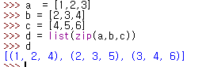

# Algorithm in Python

## Methods & ideas to Learn

`zip function` can be widely used to solve tricky questions.

1. It is easy to assume that it is only for zipping two respective lists and return list with zipped tuple as its components.

* Actually, it can zip more than two lists at the same time



> using this, you can get the vertical line from 2-dimensional matrix without recalibrating transposed matrix.

2. Moreover, it can actually zip range and list together, returning not only list as a result but in a dictionary as well. As regards to this method, you can substitute `enumerate` function in overall process.

   If you plan to use this, you should be aware that it does not strictly warrant order of its keys and value sets for it is a dictionary.

   Utilization of this method should be in conjunction with a counting sort or wherever you would need some connection between two different sets of data.

```python
num_list = ['ZRO','ONE','TWO']
conversion = dict(zip(num_list,range(len(num_list))))
# conversion = {'ZRO': 0, 'TWO': 2, 'ONE': 1}
```

3. 

